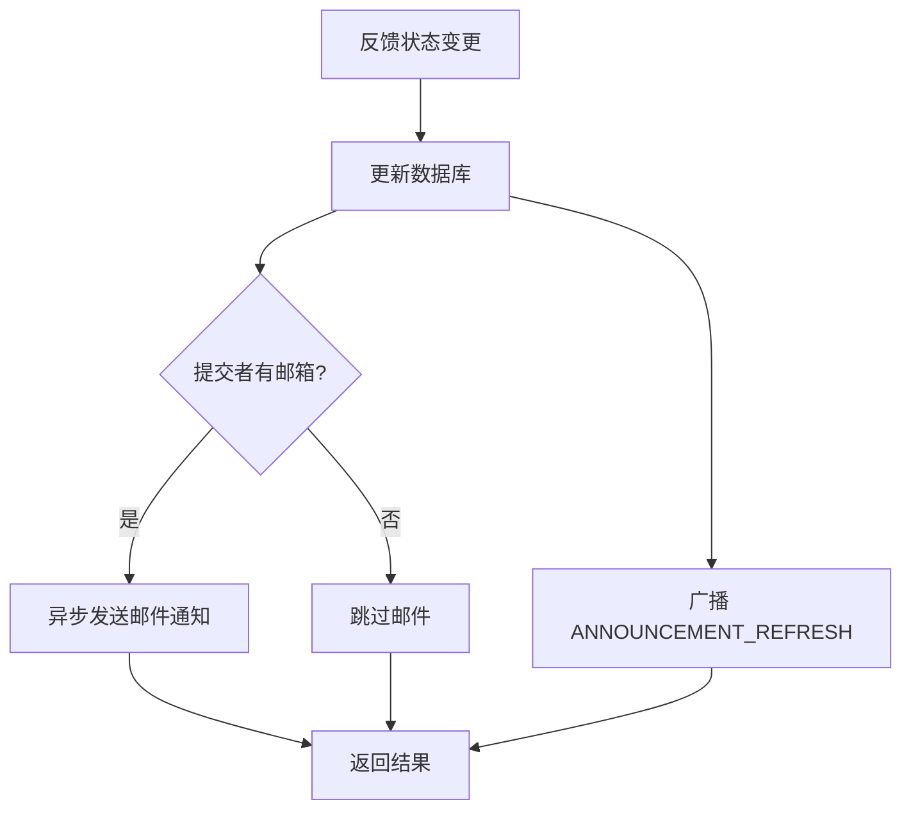

# Design: feedback-enhancement

## 方案概览

围绕反馈模块新增邮件通知与 WebSocket 广播两条链路，同时扩展开源项目模块和精简首页反馈查询。所有新增代码限定在 feedback/openproject/homepage 相关包内。

## 现状分析

- 反馈 Service：`AssistantFeedbackServiceImpl`，状态变更时无通知副作用。
- 公告广播：课程模块已有 `AnnouncementRefreshBroadcaster` 参考实现。
- 公告 Mapper：`OshAnnouncementMapper` 仅支持基础查询。
- 开源项目：`OshOpenProjectServiceImpl` 缺少技术组件库和公告能力。
- 首页反馈：`OshHomePageFeedbackMapper.xml` 使用 `HotFeedbackVO`，字段冗余。

## 详细设计

### 新增文件

| 路径 | 作用 |
|---|---|
| `FeedbackStatusMailNotifier` | 邮件通知接口，定义发送方法签名 |
| `FeedbackStatusMailNotifierImpl` | 邮件通知实现，异步构建邮件内容并发送 |
| `AnnouncementRefreshBroadcaster` | WebSocket 广播器，按 module/channel 广播刷新事件 |
| `FeedbackDynamicVO` | 反馈动态列表数据封装 |

### 修改文件

| 路径 | 改动 |
|---|---|
| `AssistantFeedbackServiceImpl` | 状态变更后调用邮件通知和广播 |
| `AssistantFeedbackLikeServiceImpl` | 点赞交互逻辑优化 |
| `AssistantFeedbackFavoriteServiceImpl` | 收藏交互逻辑优化 |
| `AssistantFeedbackDynamicServiceImpl` | 动态查询增强 |
| `OshAnnouncementMapper` | 扩展按 module/channel/limit 查询方法 |
| `AnnouncementMarqueeVO` | 字段调整兼容公共组件 |
| `OshOpenProjectServiceImpl` | 扩展技术组件库、公告等能力 |
| `OshOpenProjectSourceServiceImpl` | 开源项目数据源增强 |
| `OshOpenProjectController` | 新增接口暴露扩展能力 |
| `OshOpenProjectAnnouncementMapper` | 开源项目公告查询扩展 |
| `OshOpenProjectTechComponent` | 新增技术组件实体 |
| `OpenProjectTechComponentLibraryDTO` | 技术组件库 DTO |
| `OpenProjectVO` | 新增展示字段 |
| `OshUserController` | 微调 |
| `OshHomePageFeedbackMapper.xml` | 精简查询，移除 HotFeedbackVO 依赖 |

### 接口设计

| Method | Path | 变化 | 兼容策略 |
|---|---|---|---|
| GET | `/feedback/announcement/list` | 无变化 | 已有接口 |
| GET | `/feedback/dynamics/list` | 无变化 | 已有接口 |
| POST | `/feedback/update` | 增加邮件+广播副作用 | 不影响响应体 |
| GET | `/open-project/*` | 新增扩展字段 | 增量返回 |

### 业务流程

### 中间件影响

- Redis / Kafka / ES / Nacos / R2：无新增依赖。

## 兼容性

- 邮件发送失败仅记录 warn 日志，不阻断反馈状态更新主流程。
- 广播失败同样不阻断主流程。
- 开源项目接口返回字段为增量，不影响已有调用方。

## 测试计划

- 触发反馈状态变更，确认邮件发送。
- 确认 WebSocket 收到 `ANNOUNCEMENT_REFRESH` 广播。
- 验证开源项目扩展接口返回正确。
- `mvn compile -Dmaven.test.skip=true` 通过。
- `bash scripts/verify-ai-process.sh` 通过。

## 发布与回滚

- 发布：合并 PR 后重启后端服务。
- 回滚：revert commit，重启服务。
